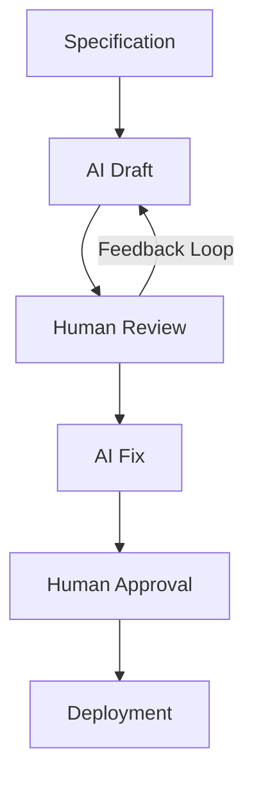

# HOKUSAI

**HOKUSAI** = **H**uman-**O**rchestrated **K**nowledge & **U**nified **S**ystem for **A**I **I**ntegration

LangGraph-based AI development workflow automation that orchestrates multiple LLMs.

[日本語版 README はこちら](./README_JP.md)

## Overview

HOKUSAI orchestrates a 10-phase development workflow that automates research, planning, implementation, verification, review, and pull-request management. It is built on [LangGraph](https://github.com/langchain-ai/langgraph) and integrates with multiple LLM-based coding agents (e.g., [Claude Code](https://claude.com/claude-code)) and the GitHub CLI (`gh`).

The name reflects the design philosophy: **humans orchestrate** decisions and review, while a **unified system** integrates AI tooling for the heavy lifting. Each phase can pause for human input, and the unified review loop in Phase 8 handles Copilot and human review comments in any order — making the workflow safe and predictable for **Human-in-the-Loop (HITL)** development.

## Why HOKUSAI?

**AI alone is not enough.**

To use AI in real-world systems — especially in regulated industries — you need:

- **Control**
- **Accountability**
- **Repeatability**

HOKUSAI is a human-centered AI workflow system designed for organizations where **trust, accountability, and control matter**.

In industries like finance, payments, and enterprise systems, AI cannot operate unchecked. Every decision must be **explainable, auditable, and ultimately owned by a human**.

HOKUSAI bridges this gap.

It transforms fragmented AI usage into a structured, repeatable workflow where:

- **AI accelerates execution**
- **Humans retain control and responsibility**
- **Knowledge and processes are standardized**
- **Every step is traceable and auditable**

Rather than replacing humans, HOKUSAI orchestrates AI around them.

It provides a unified framework to integrate AI into real-world operations — safely, transparently, and at scale.

## The Problem

AI adoption in enterprise environments is fragmented and difficult to control.

- AI usage is inconsistent across teams
- Prompts and workflows are not standardized
- Outputs are not always traceable or auditable
- Human responsibility is unclear

In regulated industries such as finance and payments, this makes it difficult to safely scale AI usage.

## The Solution

HOKUSAI provides a structured, human-in-the-loop workflow for AI integration.

It transforms ad-hoc AI usage into a repeatable and controlled process where:

- AI accelerates execution
- Humans retain decision-making authority
- Knowledge and processes are standardized
- Every step is traceable and auditable

## Architecture

HOKUSAI's architecture is built on a simple human-AI collaboration loop:

- **Draft**: AI generates initial output based on specifications
- **Review**: Human evaluates correctness, risk, and intent
- **Fix**: AI refines output based on feedback
- **Approve**: Human makes final decision
- **Deploy**: Output is released or executed

This workflow ensures both speed and control.



## Workflow

HOKUSAI is built around a simple but powerful workflow:

1. **Research** — Investigate the task scope and existing code
2. **Design** — Plan the architecture and approach
3. **Plan** — Build a step-by-step execution checklist
4. **Implement** — Execute changes via an LLM-based coding agent (Claude Code by default)
5. **Verify** — Run tests and lint to confirm correctness
6. **Review** — Final review against quality checklists
7. **Branch hygiene** — Confirm scope and base-branch consistency
8. **PR draft → Unified review loop** — Create a draft PR and handle Copilot / human review comments in any order
9. **Approval** — Human approves the PR for merge
10. **Record** — Persist outcomes for traceability and audit

Each phase can pause for human input. Humans approve transitions, request revisions, or override at any point — keeping responsibility clearly on the human side while AI handles execution.

## Key Capabilities

- **Human-in-the-loop control** — Humans approve transitions, request revisions, or override at any point
- **Standardized workflow design** — Reusable, explicit phases replace ad-hoc AI usage
- **Full traceability and auditability** — Every action is logged for review and compliance
- **AI orchestration layer** — Multiple AI tools (Claude Code, Copilot, etc.) integrated through a single workflow
- **Knowledge-driven execution (specification-first)** — Tasks start from a clear specification, not from prompt improvisation

## Use Cases

HOKUSAI is particularly suited for environments where control and accountability are critical:

- **Financial systems and payment platforms**
- **Enterprise software development**
- **Compliance-heavy operations**
- **Contract and document review workflows**

## What HOKUSAI is NOT

- **Not just an AI tool** — it's a structured workflow that uses AI
- **Not just an agent system** — humans are first-class participants, not optional reviewers
- **Not just a prompt collection** — prompts are part of a larger orchestrated process
- **Not just a RAG pipeline** — knowledge integration is one component, not the whole system

HOKUSAI is an **operational framework** for integrating AI into real-world workflows.

## Design Principles

- **Human-centered** — Humans remain responsible for decisions
- **AI-accelerated** — AI improves speed and efficiency, not the other way around
- **Workflow-driven** — Processes are explicitly defined and reusable
- **Observable** — Every action is logged and traceable
- **Scalable** — Designed for organizational adoption, not just individual use

## Features

### Standard

- 10-phase LangGraph workflow (research → design → plan → implement → verify → review → branch hygiene → PR draft → unified review loop → record)
- CLI commands: `start`, `continue`, `status`, `list`, `cleanup`, `pr-status`, `connect`, `notion-setup`, `profile`, `dashboard`
- Operations Console (`hokusai dashboard`) with service connection status, profile display, Basic Auth support, and retry/diagnostic panels
- SQLite-based persistence and LangGraph checkpointing
- LLM-based coding agent integration for autonomous implementation (Claude Code by default)
- GitHub integration via the `gh` CLI
- GitHub Issue task backend
- Notion task backend and Notion dashboard sync with SQLite outbox-based retry
- `hokusai notion-setup` for initial Notion workspace setup
- Profile-based execution scopes for multiple projects/accounts (`--profile`, `hokusai profile list/show/doctor`)
- Phase 7.5 branch hygiene checks (file scope, base-branch sync)
- Figma / Miro design context integration, including read-only context extraction and optional writeback support
- Customizable prompts in `prompts/`
- `hokusai connect <github|gitlab>` / `hokusai connect --status` for guided CLI authentication and a quick connection-status read-out
- Slack notifications (Incoming Webhook) for workflow start, human-review pauses, failures, PR creation, and completion

### Experimental

The following components are present in the codebase but are not enabled by default. Behavior may change without notice.

- **Multiple repositories** (mono-repo style) — single-repository setup is the default.
- **Cross-LLM review** — opt-in via `cross_review.enabled`. Choose the reviewer LLM with `cross_review.provider` (`codex` for OpenAI Codex CLI, or `gemini` for Google Gemini CLI; v0.4.6+).
- **Figma / Miro writeback** — disabled by default; enable per config and profile.
- **Jira / Linear task backends and Bitbucket hosting** — interfaces exist but are unfinished.
- **GitLab hosting** — client support exists, but the Phase 8 unified review loop is still GitHub-first.

## Prerequisites

- **Python**: 3.11 or later
- **`gh` CLI**: authenticated with `repo` scope (required for PR management and review-comment handling)
- **LLM-based coding agent CLI**: at least one installed and configured (e.g., Claude Code — used as the default driver for autonomous implementation)
- **Git**: 2.30 or later

The Phase 8 unified review loop replies to PR review comments via `gh`, so the authenticated user must have write access to the target repository.

## Installation

```bash
# Using uv (recommended)
uv pip install hokusai-flow

# Or using pip
pip install hokusai-flow
```

> Note: the GitHub repository name is `hokusai`, but the PyPI distribution is `hokusai-flow` because `hokusai` on PyPI is held by an unrelated project.

## Quick Start

```bash
# Start a new workflow from a GitHub issue URL
hokusai -c configs/example-github-issue.yaml start https://github.com/your-org/your-repo/issues/1

# List workflows
hokusai list

# Resume a workflow that paused for review
hokusai continue <workflow-id>

# Inspect status
hokusai status <workflow-id>

# Open the dashboard
hokusai dashboard

# Use a profile for a specific project/account
hokusai --profile company-a start https://github.com/your-org/your-repo/issues/1

# Inspect configured profiles
hokusai profile list
```

State is stored under `~/.hokusai/` by default (`workflow.db`, `checkpoint.db`, `logs/`). Override with the `data_dir` config option if needed. For multi-project operation, use profiles to isolate `data_dir`, databases, worktrees, dashboard ports, and environment-variable names per project.

## Configuration

See `configs/example-github-issue.yaml` and `configs/example-gitlab.yaml` for sample configurations. A minimal configuration looks like:

```yaml
project_root: ~/repos/my-project
base_branch: main

task_backend:
  type: github_issue

git_hosting:
  type: github
```

For profile-based operation, start from:

- `configs/example-profiles.yaml` — profile registry **example** (illustrative, multi-project)
- `configs/example-profile-company.yaml` — per-project configuration **example** (all fields)
- `configs/profile-template.yaml` — profile registry **template** for team operations (v0.4.7+, copy-and-fill placeholders)
- `configs/profile-config-template.yaml` — per-project configuration **template** (v0.4.7+, copy-and-fill placeholders)

**New team member onboarding (using templates):**

```bash
# 1. Copy the registry template to your home directory
cp configs/profile-template.yaml ~/.hokusai/profiles.yaml
chmod 600 ~/.hokusai/profiles.yaml

# 2. Copy the project config template to a shared directory
cp configs/profile-config-template.yaml ~/work/hokusai-configs/<profile_name>.yaml

# 3. Replace `<TODO:...>` placeholders (grep helps you find leftovers)
grep -n "<TODO:" ~/.hokusai/profiles.yaml ~/work/hokusai-configs/<profile_name>.yaml

# 4. Set environment variables (API tokens, etc.) in your shell rc

# 5. Verify with profile doctor
hokusai --profile <profile_name> profile doctor
```

The `example-*` files are illustrative samples covering many use cases; the `*-template.yaml` files are ready-to-copy starting points with explicit `<TODO:...>` markers.

Common profile commands:

```bash
hokusai profile list
hokusai profile show company-a
hokusai profile doctor company-a
hokusai --profile company-a dashboard
```

### Notion dashboard setup (optional)

HOKUSAI can create and sync a Notion operations dashboard through the Notion API. Token values are passed through environment variables, not YAML.

```bash
export HOKUSAI_NOTION_API_TOKEN="secret_..."
hokusai notion-setup --parent-page-id <notion-page-id> --persist
```

After setup, the generated database IDs can be referenced through environment variables such as `HOKUSAI_NOTION_WORKFLOWS_DB_ID` and `HOKUSAI_NOTION_PR_DB_ID`.

For profile-based operation with multiple Notion workspaces, the env variable names can be customized per profile in the profile config (`notion_dashboard.api_token_env` / `workflows_db_id_env` / `pull_requests_db_id_env`). When `--profile <name>` is supplied to `notion-setup`, HOKUSAI automatically reads those env names from the profile config. With `--persist` enabled, HOKUSAI writes the resolved names to the rc file using a profile-tagged marker so that multiple profiles can coexist in the same rc file (without `--persist`, only the `export` example is printed to stdout):

```bash
# profile config defines HOKUSAI_NOTION_API_TOKEN_4HOKUSAI etc.
hokusai --profile hokusai notion-setup --parent-page-id <notion-page-id> --persist
```

#### Documentation tree scaffold (v0.4.3+, v0.4.5 updates titles)

To bootstrap a Notion governance layer with the recommended documentation tree alongside the DBs, pass `--scaffold`. The tree consists of a hub `Documentation` (icon 📚) with three child pages: `議論` (icon 💬), `運用ガイド` (icon 📖), and `要件定義` (icon 📋).

```bash
hokusai --profile hokusai notion-setup \
  --parent-page-id <notion-page-id> \
  --scaffold \
  --persist
```

The flag is opt-in. The scaffold step is idempotent on a **path-specific basis**: the hub page `Documentation` is looked up directly under the parent, and the three category pages are looked up under the hub. A page with the same title that exists at a different location (e.g. `議論` directly under the parent rather than under the hub) is **not** treated as existing and will not block creation. Note that the DB creation step is **not** idempotent: re-running `notion-setup` will create new `Workflows DB` / `Pull Requests DB` each time, so only re-run when you intend to provision a fresh DB pair (or archive the old DBs in Notion first).

> **v0.4.5 / Issue #29**: Dropped the `HOKUSAI` prefix from databases / hub page (the parent page typically provides the HOKUSAI context). Subpage titles are now Japanese (`議論` / `運用ガイド` / `要件定義`). Pages created by older versions are still detected on re-run via backward-compatible aliases for two generations: v0.4.3 (emoji-prefixed titles) and v0.4.4 (HOKUSAI-prefixed English titles). To align the UI with the new naming, rename the existing pages in Notion (the icon remains).

### Figma / Miro integration (optional)

Figma and Miro integrations can read design context into the workflow. Writeback for comments/cards is available behind explicit config flags.

```yaml
figma:
  enabled: true
  api_token_env: HOKUSAI_FIGMA_API_TOKEN
  writeback:
    enabled: false

miro:
  enabled: true
  api_token_env: HOKUSAI_MIRO_API_TOKEN
  writeback:
    enabled: false
```

API tokens should be provided through environment variables. Do not store them in YAML.

### Slack notifications (optional)

HOKUSAI can post workflow events to a Slack Incoming Webhook. The webhook URL is **never** stored in YAML — pass it via an environment variable.

```bash
export HOKUSAI_SLACK_WEBHOOK_URL="https://hooks.slack.com/services/T.../B.../..."
```

```yaml
notifications:
  slack:
    enabled: true
    webhook_url_env: HOKUSAI_SLACK_WEBHOOK_URL  # default
    events:
      - waiting_for_human
      - workflow_failed
      - pr_created
      - workflow_completed
    timeout: 5.0  # seconds, clamped to [1.0, 30.0]
```

Supported events: `workflow_started`, `waiting_for_human`, `workflow_failed`, `pr_created`, `workflow_completed`.

If sending fails (timeout, HTTP error, network error), the workflow continues running — notification failures never abort the workflow. The webhook URL is not written to logs or DB. Pasting the webhook URL directly into the YAML triggers a `Slack Incoming Webhook URL` warning in the dashboard.

## Documentation

- Implementation prompts: `prompts/`
- Phase node sources: `hokusai/nodes/`
- Configuration model: `hokusai/config/models.py`
- Profile operation guide: `docs/profile-operation-guide.md`
- Notion dashboard operation guide: `docs/notion-dashboard-operation-guide.md`
- Figma / Miro operation guide: `docs/figma-miro-integration-operation-guide.md`

## Limitations

- The unified review loop in Phase 8 currently assumes GitHub-based pull requests. GitLab/Bitbucket support is experimental.
- Profiles support multiple projects/accounts in parallel, but concurrent workflows for the same task URL within the same profile are not supported.
- Prompts in `prompts/` are tuned for Japanese-language tasks; English-language tuning is under way.

## License

Apache License 2.0. See [LICENSE](./LICENSE).

## Contributing

This project is in alpha. Issues and pull requests are welcome — please open an issue first to discuss substantial changes.
