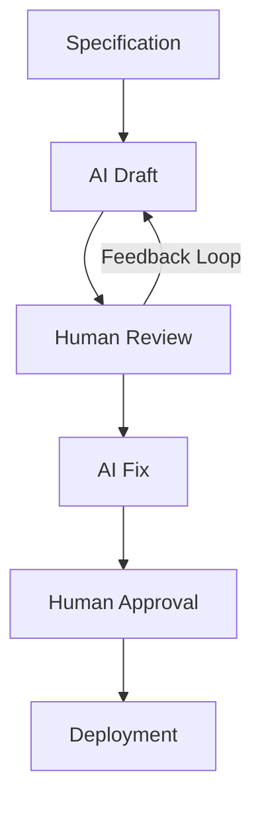

# HOKUSAI

**HOKUSAI** = **H**uman-**O**rchestrated **K**nowledge & **U**nified **S**ystem for **A**I **I**ntegration

LangGraph をベースに、複数の LLM をオーケストレーションする AI 開発ワークフロー自動化ツール。

[English README is here](./README.md)

## 概要

HOKUSAI は調査・計画・実装・検証・レビュー・プルリクエスト管理を自動化する 10 フェーズの開発ワークフローをオーケストレーションする。[LangGraph](https://github.com/langchain-ai/langgraph) 上に構築され、複数の LLM ベースのコーディングエージェント（[Claude Code](https://claude.com/claude-code) など）および GitHub CLI (`gh`) と統合される。

名前は設計思想を反映している。意思決定とレビューは **人間がオーケストレーション** し、AI ツール群を **統合システム** が連携させて実装・検証を担う。各フェーズは人間の判断を待つために一時停止可能で、Phase 8 の統合レビューループは Copilot と人間のレビューコメントを順不同で処理する。これにより **Human-in-the-Loop (HITL)** な開発を安全かつ予測可能に進められる。

## なぜ HOKUSAI なのか

**AI だけでは不十分です。**

実世界のシステム ─ とりわけ規制業界 ─ で AI を活用するには、以下が必要です:

- **コントロール（Control）**
- **説明責任（Accountability）**
- **再現性（Repeatability）**

HOKUSAI は、**信頼性・説明責任・コントロール** が重視される組織のために設計された、人間中心の AI ワークフローシステムです。

金融、決済、エンタープライズシステムといった業界では、AI を野放しで動作させることはできません。あらゆる意思決定は **説明可能（explainable）で、監査可能（auditable）で、最終的に人間が責任を負う（owned by a human）** 必要があります。

HOKUSAI はこのギャップを橋渡しします。

断片化した AI の利用を、構造化された再現可能なワークフローに変換します:

- **AI が実行を加速する**
- **人間がコントロールと責任を保持する**
- **知識とプロセスが標準化される**
- **すべてのステップが追跡可能で監査可能**

HOKUSAI は人間を置き換えるのではなく、人間を中心に AI をオーケストレーションします。

実世界の業務に AI を統合する統一フレームワークを、**安全に・透明性をもって・スケーラブルに** 提供します。

## 課題（The Problem）

エンタープライズ環境での AI 活用は、断片的でコントロールが難しい状況にあります。

- チームごとに AI の使い方がばらばら
- プロンプトやワークフローが標準化されていない
- アウトプットが必ずしも追跡可能・監査可能ではない
- 人間の責任範囲が不明瞭

金融や決済のような規制業界では、これが安全に AI 活用をスケールさせる障害になります。

## 解決策（The Solution）

HOKUSAI は、AI 統合のための構造化された Human-in-the-Loop ワークフローを提供します。

場当たり的な AI 利用を、再現可能でコントロール可能なプロセスに変換します:

- AI が実行を加速する
- 人間が意思決定の権限を保持する
- 知識とプロセスが標準化される
- すべてのステップが追跡可能で監査可能

## アーキテクチャ

HOKUSAI のアーキテクチャは、シンプルな人間と AI の協働ループを基盤としています:

- **Draft（草案作成）**: AI が仕様に基づき最初のアウトプットを生成
- **Review（レビュー）**: 人間が正しさ・リスク・意図を評価
- **Fix（修正）**: AI がフィードバックに基づいてアウトプットを改善
- **Approve（承認）**: 人間が最終的な意思決定を行う
- **Deploy（デプロイ）**: アウトプットがリリース・実行される

このワークフローによって、**スピードとコントロールの両立** を実現します。



## ワークフロー

HOKUSAI はシンプルでパワフルなワークフローを軸に設計されています:

1. **Research（調査）** — タスクのスコープと既存コードを調査
2. **Design（設計）** — アーキテクチャと方針を計画
3. **Plan（計画）** — 実行チェックリストを段階的に構築
4. **Implement（実装）** — LLM ベースのコーディングエージェント経由で変更を実行（デフォルトは Claude Code）
5. **Verify（検証）** — テストと lint で正しさを確認
6. **Review（レビュー）** — 品質チェックリストに沿った最終レビュー
7. **Branch hygiene（ブランチ衛生）** — スコープとベースブランチの整合性を確認
8. **PR draft → 統合レビューループ** — Draft PR を作成し、Copilot/人間のレビューコメントを順不同で処理
9. **Approval（承認）** — マージのために人間が PR を承認
10. **Record（記録）** — トレーサビリティと監査のために結果を永続化

各フェーズは人間の入力を待つために一時停止可能です。人間が遷移を承認したり、修正を要求したり、いつでも介入できます。**責任は人間側に明確に置きながら、AI が実行を担当する**設計になっています。

## 主要な能力（Key Capabilities）

- **Human-in-the-loop コントロール** — 人間が遷移を承認・修正要求・任意の地点で介入できる
- **標準化されたワークフロー設計** — 再利用可能な明示的フェーズが場当たり的な AI 利用を置き換える
- **完全なトレーサビリティと監査性** — すべてのアクションがレビュー・コンプライアンスのために記録される
- **AI オーケストレーション層** — 複数の AI ツール（Claude Code、Copilot など）を単一のワークフローに統合
- **知識駆動の実行（specification-first）** — タスクは明確な仕様から始まる。プロンプトの即興からではない

## ユースケース

HOKUSAI は、特にコントロールと説明責任が重要な環境に向いています:

- **金融システム・決済プラットフォーム**
- **エンタープライズソフトウェア開発**
- **コンプライアンスが重い業務**
- **契約書・文書レビューのワークフロー**

## HOKUSAI が「ではない」もの（What HOKUSAI is NOT）

- **単なる AI ツールではない** — AI を活用する **構造化されたワークフロー** である
- **単なるエージェントシステムではない** — 人間はオプションのレビュアーではなく、ファーストクラスの参加者
- **単なるプロンプト集ではない** — プロンプトは大きなオーケストレーションプロセスの一部
- **単なる RAG パイプラインではない** — 知識統合は構成要素のひとつで、システム全体ではない

HOKUSAI は、AI を実世界のワークフローに統合する **運用フレームワーク（operational framework）** です。

## 設計原則（Design Principles）

- **人間中心（Human-centered）** — 意思決定の責任は人間が保持する
- **AI による加速（AI-accelerated）** — AI はスピードと効率を改善する。逆ではない
- **ワークフロー駆動（Workflow-driven）** — プロセスは明示的に定義され再利用可能
- **観測可能（Observable）** — すべてのアクションがログに記録され追跡可能
- **スケーラブル（Scalable）** — 個人利用ではなく組織導入を前提に設計

## 機能

### 標準機能

- 10 フェーズの LangGraph ワークフロー（調査 → 設計 → 計画 → 実装 → 検証 → レビュー → ブランチ衛生 → PR draft → 統合レビューループ → 記録）
- CLI コマンド: `start`、`continue`、`status`、`list`、`cleanup`、`pr-status`、`connect`
- Web ダッシュボード（`scripts/dashboard.py`）にサービス接続状態パネルと再チェックボタンを内蔵
- SQLite による永続化と LangGraph checkpoint
- LLM ベースのコーディングエージェント連携による自律実装（デフォルトは Claude Code）
- `gh` CLI 経由の GitHub 連携
- GitHub Issue タスクバックエンド
- Phase 7.5 ブランチ衛生チェック（ファイルスコープ、ベースブランチ同期）
- `prompts/` 配下のカスタマイズ可能なプロンプト
- `hokusai connect <github|gitlab>` / `hokusai connect --status` による CLI 認証導線と接続状態の一括表示
- Slack 通知（Incoming Webhook 経由）— ワークフロー開始 / Human-in-the-loop 待機 / 失敗 / PR 作成 / 完了をチームへ通知

### 実験的機能

以下のコンポーネントはコードベースに含まれるがデフォルトでは有効化されない。挙動は予告なく変更される可能性がある。

- **Notion タスクバックエンド** — `HOKUSAI_SKIP_NOTION=1` で Notion アクセスをスキップする
- **複数リポジトリ対応**（モノレポ風） — デフォルトは単一リポジトリ
- **クロス LLM レビュー** — 複数 LLM のセットアップが必要
- **Jira / Linear / GitLab / Bitbucket 連携** — インターフェースは存在するが未完成

## 前提条件

- **Python**: 3.11 以降
- **`gh` CLI**: `repo` スコープで認証済み（PR 管理とレビューコメント返信に必要）
- **LLM ベースのコーディングエージェント CLI**: 少なくとも 1 つがインストール・設定済み（例: Claude Code — 自律実装のデフォルト駆動役として使用）
- **Git**: 2.30 以降

Phase 8 の統合レビューループは `gh` 経由で PR レビューコメントに返信するため、認証ユーザーが対象リポジトリへの write 権限を持っている必要がある。

## インストール

```bash
# uv 推奨
uv pip install hokusai-flow

# または pip
pip install hokusai-flow
```

> 注: GitHub リポジトリ名は `hokusai` だが、PyPI 配布名は `hokusai-flow`。これは PyPI 上で `hokusai` が無関係のプロジェクトに既に取得されているため。

## クイックスタート

```bash
# GitHub Issue URL から新規ワークフローを開始
hokusai -c configs/example-github-issue.yaml start https://github.com/your-org/your-repo/issues/1

# ワークフロー一覧
hokusai list

# レビューで停止したワークフローを再開
hokusai continue <workflow-id>

# 状態確認
hokusai status <workflow-id>

# ダッシュボードを開く
python scripts/dashboard.py
```

状態はデフォルトで `~/.hokusai/` 配下に保存される（`workflow.db`、`checkpoint.db`、`logs/`）。必要に応じて設定の `data_dir` で上書き可能。

## 設定

サンプルは `configs/example-github-issue.yaml` および `configs/example-gitlab.yaml` を参照。最小構成は以下:

```yaml
project_root: ~/repos/my-project
base_branch: main

task_backend:
  type: github_issue

git_hosting:
  type: github
```

### Slack 通知（任意）

Slack Incoming Webhook を使ってワークフローイベントを Slack に通知できる。Webhook URL は YAML には書かず、必ず環境変数経由で渡す。

```bash
export HOKUSAI_SLACK_WEBHOOK_URL="https://hooks.slack.com/services/T.../B.../..."
```

```yaml
notifications:
  slack:
    enabled: true
    webhook_url_env: HOKUSAI_SLACK_WEBHOOK_URL  # デフォルト
    events:
      - waiting_for_human
      - workflow_failed
      - pr_created
      - workflow_completed
    timeout: 5.0  # 秒。1.0〜30.0 の範囲にクランプされる
```

サポートしているイベント: `workflow_started`、`waiting_for_human`、`workflow_failed`、`pr_created`、`workflow_completed`。

送信失敗（タイムアウト・HTTP エラー・ネットワークエラー）はワークフロー本体を止めない（best effort）。Webhook URL はログにも DB にも書き込まれない。誤って YAML に webhook URL を直書きするとダッシュボードで `Slack Incoming Webhook URL` の警告が出る。

## ドキュメント

- 実装プロンプト: `prompts/`
- 各フェーズノードのソース: `hokusai/nodes/`
- 設定モデル: `hokusai/config/models.py`

## 制限事項

- Phase 8 の統合レビューループは現状 GitHub のプルリクエスト前提。GitLab/Bitbucket 対応は実験的。
- CLI はシングルユーザー想定。同一タスク URL に対する並行ワークフローはサポートしない。
- `prompts/` 配下のプロンプトは日本語タスク向けに調整されている。英語タスク向けの調整は進行中。

## ライセンス

Apache License 2.0。[LICENSE](./LICENSE) を参照。

## コントリビューション

このプロジェクトは alpha 段階。Issue と Pull Request は歓迎。大きな変更については、まず Issue を起票して相談してほしい。
